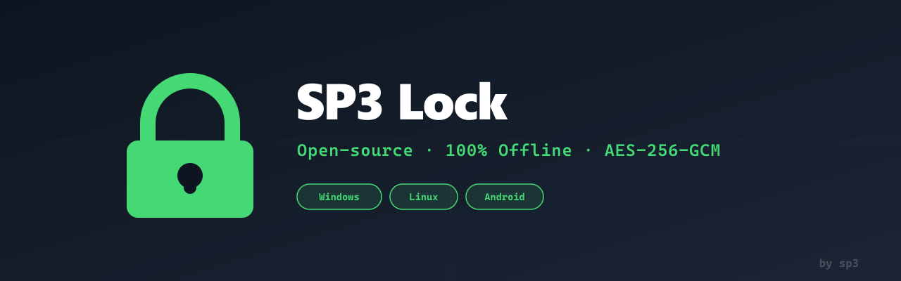
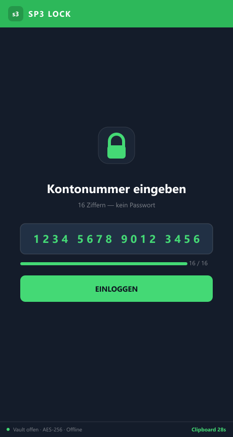
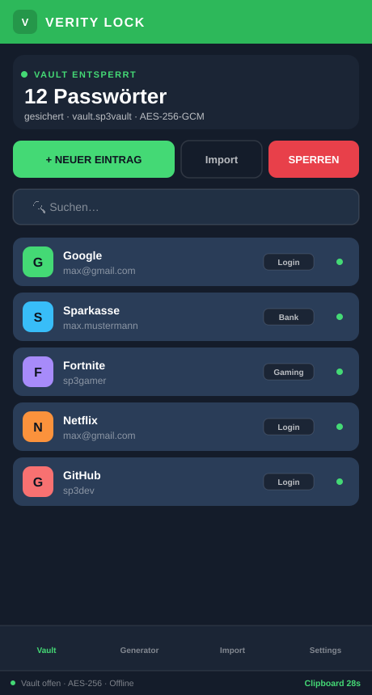
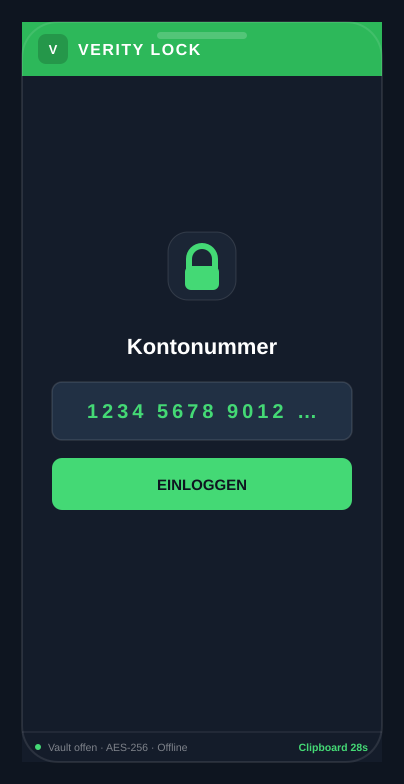
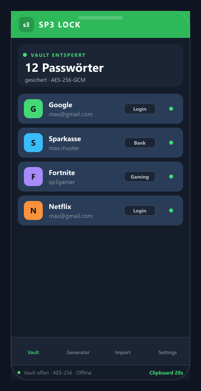

<div align="center">



<br/>


# Verity Lock

**Open-source password manager — 100% offline, portable, military-grade encryption**

<br/>

[](LICENSE)
[](../../releases)
[](https://tauri.app)
[]()
[](https://discord.gg/sp3)

<br/>

[⬇️ Download](#️-download) · [✨ Features](#-features) · [🔒 Security](#-security) · [🛠️ Build](#️-build-from-source)

</div>

---

## ✨ Features

<table>
<tr>
<td width="50%">

**🔐 Sicherheit**
- AES-256-GCM Verschlüsselung
- Argon2id Key Derivation (64 MB)
- RAM-Wiping nach Benutzung
- Brute-Force-Schutz (exponentiell)
- Screenshot-Schutz (Android)

</td>
<td width="50%">

**📱 Plattformen**
- Windows 10/11 (Installer + Portable)
- Linux (DEB + AppImage)
- Android 8.0+ (APK)
- USB-Stick ready — kein Install nötig

</td>
</tr>
<tr>
<td width="50%">

**🔑 Kontonummer-System**
- Kein Benutzername, kein Passwort
- 16-stellige Zufallsnummer = einziger Schlüssel
- Mullvad-Style Login
- Nummer wird nie gespeichert

</td>
<td width="50%">

**📥 Import**
- Bitwarden (JSON)
- KeePass (XML)
- 1Password, LastPass (CSV)
- Chrome, Firefox (CSV)
- Generisches CSV

</td>
</tr>
</table>

---

## ⬇️ Download

<div align="center">

| Plattform | Download | Typ |
|:---:|:---:|:---:|
| 🪟 **Windows** | [`verity-lock_1.0.0_x64-setup.exe`](../../releases/latest) | Installer |
| 🪟 **Windows** | [`verity-lock-portable-win.zip`](../../releases/latest) | Portable (USB) |
| 🐧 **Linux** | [`verity-lock_1.0.0_amd64.deb`](../../releases/latest) | Debian/Ubuntu |
| 🐧 **Linux** | [`verity-lock_1.0.0_amd64.AppImage`](../../releases/latest) | Universal |
| 🤖 **Android** | [`verity-lock_1.0.0_android.apk`](../../releases/latest) | APK |

</div>

> **Android:** Einstellungen → Apps → Unbekannte Quellen → erlauben → APK installieren

---

## 🔒 Security

Verity Lock speichert **niemals** etwas unverschlüsselt auf der Festplatte.

```
vault.sp3vault (binäres Format):
┌─────────────────────────────────┐
│ Magic  "SP3V" + Version          │
│ Salt   — 32 Bytes (zufällig)     │ → Argon2id
│ Nonce  — 12 Bytes (zufällig)     │ → AES-256-GCM
│ Ciphertext — AES-256-GCM         │
│   └─ Alle Einträge (encrypted)   │
└─────────────────────────────────┘
```

**Ohne Verity Lock + korrekte Kontonummer ist die Vault-Datei nicht lesbar.**

Keine Netzwerkverbindung — kein Telemetry — kein Account — kein Server.

> Hinweis: Auf Android wird (mangels Argon2 im Browser) PBKDF2-SHA-256 (210 000
> Iterationen) statt Argon2id verwendet. Desktop- und Android-Vaults sind daher
> nicht gegenseitig kompatibel — jede Plattform liest ihr eigenes Format.

Vulnerability Reports: Discord `https://discord.gg/FbJaSSGtB6` (DM @sp3) oder [SECURITY.md](SECURITY.md)

---

## 🛠️ Build from source

```bash
# Voraussetzungen: Rust (stable), Node.js 18+, Tauri CLI

git clone https://github.com/S-P-3-3/verity-lock.git
cd verity-lock
npm install
npm run tauri dev        # Entwicklung
npm run tauri build      # Release-Build
```

Android:

```bash
npm run build
npx cap sync android
cd android && ./gradlew assembleRelease
```

---

## 📸 Screenshots

<div align="center">
  
  
</div>
<div align="center">
  
  
</div>

---

## 📁 Ordnerstruktur

```
verity-lock/
├── src/              React Frontend
├── src-tauri/        Rust Backend (Crypto, Vault, Tauri Commands)
├── android/          Capacitor Android Projekt
├── icons/            App Icons
├── assets/           Screenshots, Banner
├── scripts/          Build-Scripts
├── .github/
│   └── workflows/    GitHub Actions (Auto-Build + Release)
├── README.md
├── LICENSE           GPL-3.0
├── SECURITY.md
└── CONTRIBUTING.md
```

---

## 🤝 Contributing

Pull Requests willkommen! Bitte zuerst ein Issue öffnen für größere Änderungen.
Siehe [CONTRIBUTING.md](CONTRIBUTING.md) für Details.

<div align="center">

Made with ❤️ by [Verity](https://discord.gg/FbJaSSGtB6)

⭐ Star das Repo wenn es dir gefällt!

</div>
